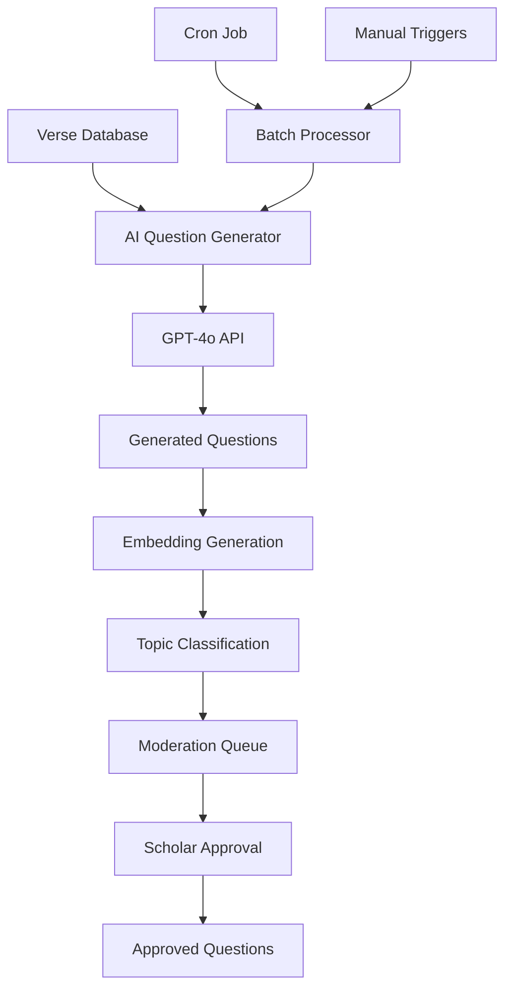

# AI Question Generation System Documentation

## Overview

The AI Question Generation System is a comprehensive solution for automatically generating high-quality quiz questions from Quranic verses using OpenAI's GPT-4o model. The system generates both Multiple Choice Questions (MCQ) and fill-in-the-blank questions, creates semantic embeddings for search, and manages a scholar moderation workflow.

## System Architecture



## Core Components

### 1. AIQuestionGenerator (`src/lib/ai-question-generator.ts`)

**Purpose**: Core service for generating questions from Quranic verses

**Key Features**:
- Generates MCQ and fill-in-the-blank questions
- Uses GPT-4o for high-quality generation
- Creates semantic embeddings for search
- Validates generated content
- Supports topic classification

**Methods**:
- `generateQuestionsForVerse(verse, count)` - Generate questions for a single verse
- `generateEmbeddings(questions)` - Create vector embeddings
- `saveQuestionsToModerationQueue()` - Save to database for approval
- `classifyTopics()` - Auto-classify question topics

### 2. BatchProcessor (`src/lib/batch-processor.ts`)

**Purpose**: Manages batch processing of verses for question generation

**Key Features**:
- Processes verses in batches to respect API rate limits
- Prioritizes commonly memorized verses
- Tracks processing statistics
- Handles errors gracefully
- Supports manual verse-specific generation

**Methods**:
- `processBatch()` - Main batch processing function
- `getVersesForProcessing()` - Get verses needing questions
- `getBatchStats()` - Get processing statistics
- `generateQuestionsForSpecificVerses()` - Manual generation

### 3. API Endpoints

#### `/api/ai/batch-process`
- **GET**: Get batch processing statistics
- **POST**: Manually trigger batch processing (scholars only)

#### `/api/ai/generate-questions`
- **POST**: Generate questions for specific verses (scholars only)

#### `/api/cron/question-generation`
- **GET/POST**: Cron endpoint for automated processing

## Question Types

### Multiple Choice Questions (MCQ)

**Structure**:
```json
{
  "prompt": "What is the main theme of this verse?",
  "choices": [
    "A. Prayer and worship",
    "B. Social justice",
    "C. Family relationships", 
    "D. Business ethics"
  ],
  "answer": "A. Prayer and worship",
  "difficulty": "medium",
  "topics": ["worship", "prayer"],
  "explanation": "This verse emphasizes the importance of regular prayer..."
}
```

**Focus Areas**:
- Verse meaning and context
- Thematic understanding
- Key concepts and vocabulary
- Historical context
- Spiritual lessons

### Fill-in-the-Blank Questions

**Structure**:
```json
{
  "prompt": "Complete the verse: بِسْمِ اللَّهِ الرَّحْمَٰنِ ______",
  "choices": [
    "A. الرَّحِيمِ",
    "B. الْغَفُورِ", 
    "C. الْعَزِيزِ",
    "D. الْحَكِيمِ"
  ],
  "answer": "A. الرَّحِيمِ",
  "difficulty": "easy",
  "topics": ["memorization", "arabic_vocabulary"],
  "explanation": "This completes the Basmalah, the opening phrase of most surahs"
}
```

**Focus Areas**:
- Arabic memorization
- Word recognition
- Diacritical marks accuracy
- Sequence memorization

## Database Schema

### Enhanced Questions Table

```sql
ALTER TABLE questions ADD COLUMN:
- topics TEXT[] -- Array of topic tags
- explanation TEXT -- Explanation of correct answer  
- embedding vector(1536) -- Semantic embedding
- question_type VARCHAR(20) -- 'mcq' or 'fill_blank'
- ai_generated BOOLEAN -- Whether AI generated
- generation_model VARCHAR(50) -- Model used
- confidence_score DECIMAL(3,2) -- AI confidence
```

### New Tables

#### batch_runs
Tracks AI generation batch processing:
```sql
- verses_processed INTEGER
- questions_generated INTEGER  
- questions_saved INTEGER
- errors INTEGER
- duration_seconds INTEGER
- success BOOLEAN
- error_message TEXT
- run_at TIMESTAMP
```

#### question_topics
Hierarchical topic management:
```sql
- name VARCHAR(100) UNIQUE
- description TEXT
- category VARCHAR(50) 
- parent_topic_id UUID
```

#### verse_processing_status
Tracks verse processing status:
```sql
- verse_id UUID PRIMARY KEY
- questions_generated INTEGER
- last_processed_at TIMESTAMP
- processing_status VARCHAR(20)
- priority_score INTEGER
```

## Topic Classification

### Core Topics
- **Core Beliefs**: faith, guidance, creation, afterlife
- **Worship**: prayer, charity, fasting, pilgrimage, remembrance
- **Character**: forgiveness, morality, justice, mercy, patience, gratitude
- **Social**: family, community, knowledge
- **Attributes of Allah**: mercy, justice, wisdom
- **Prophetic Tradition**: prophets, messengers

### Auto-Classification
The system automatically classifies questions using:
1. Keyword matching in prompts and explanations
2. Context analysis of verse content
3. Semantic similarity to known topics
4. Manual topic tags from scholars

## Quality Assurance

### AI Generation Standards
- **Accuracy**: No hallucinations - all content must be factually correct
- **Respect**: Islamic terminology and cultural sensitivity
- **Educational Value**: Questions test meaningful understanding
- **Difficulty Balance**: 40% easy, 40% medium, 20% hard
- **Language Integrity**: Preserve Uthmani script Arabic

### Validation Pipeline
1. **Structure Validation**: Ensure proper JSON format and required fields
2. **Content Validation**: Check for inappropriate content
3. **Arabic Validation**: Verify Arabic text integrity
4. **Difficulty Assessment**: Ensure appropriate difficulty distribution
5. **Scholar Review**: Mandatory approval before serving

### Confidence Scoring
Each generated question receives a confidence score (0.0-1.0):
- **0.9-1.0**: High confidence, likely accurate
- **0.7-0.9**: Medium confidence, review recommended  
- **0.5-0.7**: Low confidence, careful review needed
- **<0.5**: Very low confidence, likely needs revision

## Batch Processing

### Automated Processing
- **Schedule**: Every 4 hours via cron job
- **Batch Size**: 50 verses per batch
- **Rate Limiting**: 1 second delay between verses
- **Error Handling**: Continue processing on individual failures

### Prioritization Algorithm
Verses are prioritized based on:
1. **Priority Score**: Pre-assigned based on memorization importance
2. **Question Deficit**: Verses with fewer existing questions
3. **User Demand**: Popular verses in user practice
4. **Surah Popularity**: Commonly recited surahs

### Priority Scoring
- **Al-Fatiha (Surah 1)**: 100 points (highest priority)
- **Last 3 Surahs (112-114)**: 90 points
- **Short Surahs**: 80 points
- **Beginning of Al-Baqarah**: 70 points
- **Popular Long Surahs**: 60 points
- **Default**: 10 points

## Monitoring and Analytics

### Key Metrics
- **Generation Rate**: Questions generated per hour
- **Success Rate**: Percentage of successful generations
- **Quality Score**: Average confidence scores
- **Processing Time**: Average time per verse
- **Error Rate**: Failed generations percentage
- **Scholar Approval Rate**: Percentage of questions approved

### Monitoring Dashboard Data
```json
{
  "total_runs": 150,
  "successful_runs": 145,
  "success_rate": 96.67,
  "total_questions_generated": 2180,
  "pending_questions": 45,
  "approved_questions": 2135,
  "average_duration_seconds": 125.5
}
```

### Error Tracking
Common error categories:
- **API Timeouts**: OpenAI API latency issues
- **Rate Limits**: Exceeding API quota  
- **Generation Failures**: GPT-4o unable to generate valid questions
- **Database Errors**: Connection or insertion failures
- **Validation Failures**: Generated content doesn't meet standards

## Setup and Configuration

### Environment Variables
```bash
# Required
OPENAI_API_KEY=your_openai_api_key
NEXT_PUBLIC_SUPABASE_URL=your_supabase_url
SUPABASE_SERVICE_ROLE_KEY=your_service_role_key

# Optional
CRON_SECRET=your_cron_secret_for_automated_processing
```

### Database Setup
1. Run the schema updates:
   ```bash
   # In Supabase SQL Editor
   # Execute supabase/ai-schema-updates.sql
   ```

2. Verify vector extension:
   ```sql
   CREATE EXTENSION IF NOT EXISTS vector;
   ```

### Cron Job Setup
Set up automated processing with your preferred cron service:

**Vercel Cron** (vercel.json):
```json
{
  "crons": [{
    "path": "/api/cron/question-generation",
    "schedule": "0 */4 * * *"
  }]
}
```

**External Cron Service**:
```bash
# Every 4 hours
0 */4 * * * curl -H "Authorization: Bearer YOUR_CRON_SECRET" \
  https://yourapp.vercel.app/api/cron/question-generation
```

## Usage Examples

### Test Question Generation
```bash
# Run test script
npx tsx scripts/test-ai-generation.ts

# Test specific surah
curl -X POST /api/ai/generate-questions \
  -H "Authorization: Bearer scholar_token" \
  -d '{"surah": 112}'
```

### Manual Batch Processing
```bash
# Trigger manual batch
curl -X POST /api/ai/batch-process \
  -H "Authorization: Bearer scholar_token"
```

### Get Statistics
```bash
# Get batch statistics  
curl /api/ai/batch-process \
  -H "Authorization: Bearer user_token"
```

## Scholar Workflow

### Moderation Queue
Scholars can review pending questions through:
1. **GET** `/api/questions/pending` - List pending questions
2. **POST** `/api/questions/{id}/approve` - Approve question
3. **POST** `/api/questions/{id}/reject` - Reject question

### Review Criteria
Scholars should verify:
- **Theological Accuracy**: Correct Islamic understanding
- **Arabic Accuracy**: Proper diacritics and spelling
- **Answer Correctness**: Correct answer choice
- **Distractor Quality**: Plausible but incorrect alternatives
- **Educational Value**: Meaningful learning objective
- **Cultural Sensitivity**: Appropriate tone and context

### Enhanced Review Features
- **Confidence Scores**: AI-provided confidence levels
- **Topic Tags**: Auto-generated topic classifications
- **Explanations**: AI-generated explanations for answers
- **Source Verification**: Links to original verse context

## Performance Considerations

### Rate Limiting
- **OpenAI API**: 10,000 TPM (tokens per minute) on GPT-4o
- **Embedding API**: 3,000 RPM (requests per minute)
- **Batch Processing**: 1 request per second to avoid limits
- **Concurrent Limits**: Max 10 simultaneous requests

### Cost Management
- **Generation Cost**: ~$0.01-0.03 per question pair
- **Embedding Cost**: ~$0.0001 per question  
- **Monthly Budget**: Estimated $50-200 for 5K questions
- **Optimization**: Batch processing reduces overhead

### Scalability
- **Database**: PostgreSQL with vector extensions
- **Storage**: ~1KB per question with embeddings
- **Search Performance**: Vector index for <100ms similarity search
- **Processing**: Can handle 1000+ verses per hour

## Troubleshooting

### Common Issues

**1. OpenAI API Key Issues**
```bash
Error: Invalid API key
Solution: Check OPENAI_API_KEY environment variable
```

**2. Rate Limit Exceeded**  
```bash
Error: Rate limit exceeded
Solution: Reduce batch size or increase delays
```

**3. Database Connection Errors**
```bash
Error: Connection refused  
Solution: Verify Supabase credentials and RLS policies
```

**4. Vector Extension Missing**
```bash
Error: vector type does not exist
Solution: Enable vector extension in Supabase
```

### Debug Mode
Enable detailed logging by setting:
```bash
DEBUG=ai-generation:* npm run dev
```

### Health Checks
Monitor system health:
- **Database Connection**: Test with simple query
- **OpenAI API**: Test with basic completion
- **Vector Search**: Test similarity search
- **Batch Processing**: Check recent batch run status

## Future Enhancements

### Planned Features
1. **Advanced Topic Classification**: ML-based topic detection
2. **Difficulty Calibration**: User performance-based difficulty adjustment  
3. **Multilingual Support**: Questions in multiple languages
4. **Audio Integration**: Text-to-speech for Arabic pronunciation
5. **Adaptive Learning**: Personalized question difficulty
6. **Scholar Feedback Loop**: Incorporate scholar corrections into training

### Integration Opportunities
- **Spaced Repetition**: Integration with SRS algorithms
- **Progress Tracking**: Detailed learning analytics
- **Social Features**: Community-generated questions
- **Mobile App**: Native mobile question interface
- **Offline Mode**: Cached questions for offline use

## Support and Maintenance

### Monitoring
- **Daily**: Check batch run success rates
- **Weekly**: Review scholar approval rates  
- **Monthly**: Analyze cost and usage patterns
- **Quarterly**: Update topic classifications and priorities

### Maintenance Tasks
- **Database Cleanup**: Remove rejected questions after 30 days
- **Vector Index**: Rebuild indexes monthly for performance
- **Cost Optimization**: Review and optimize API usage
- **Scholar Training**: Regular training sessions on review criteria

### Support Channels
- **Technical Issues**: GitHub issues or support email
- **Scholar Questions**: Dedicated scholar support portal
- **User Feedback**: In-app feedback system
- **Emergency**: 24/7 monitoring for critical failures

---

*This documentation covers the complete AI Question Generation system. For additional technical details, refer to the source code and API documentation.*