# Qur’an Verse Challenge — Product Requirements Document

_Version 0.1  |  Last updated: 2025‑08‑07_

---

## 1  Overview

A gamified SaaS that helps users memorise and understand Qur’anic verses through daily AI‑generated quizzes, recitation challenges, and scholar‑verified explanations. Built as an **AI‑native** product, it relies on a network of Claude Code agents that collaborate (in parallel where possible) to automate content generation, code delivery, QA, and deployment.

---

## 2  Goals & Success Metrics

| Objective        | KPI                                 | Target @ Month 6 |
| ---------------- | ----------------------------------- | ---------------- |
| User acquisition | Registered learners                 | ≥ 10 k           |
| Engagement       | Avg DAU / MAU                       | ≥ 40 %           |
| Learning outcome | Verse‑recall accuracy after 30 days | ≥ 70 %           |
| Revenue          | MRR                                 | ≥ US \$5 k       |

---

## 3  Personas

1. **Everyday Learner** – College‑age Muslim aiming to finish 30 juz’ memorisation.
2. **Madrasah Teacher** – Needs ready‑made, reliable quizzes for class.
3. **Revert Muslim** – Wants structured entry‑level guidance.

---

## 4  Scope

### 4.1 MVP (first 3 months)

- Verse Quiz Engine (MCQ & fill‑in‑the‑blank)
- Daily Challenge & Streaks
- Progress Dashboard (per juz’, surah, topic)
- Scholar Moderation Queue

### 4.2 Phase 2 (months 4‑9)

- Speech‑to‑Recitation Scoring
- Spaced‑Repetition Review Stack
- Group Mode / Leaderboards

---

## 5  Functional Requirements

| #      | Requirement                                                      | Acceptance Criteria                                    |
| ------ | ---------------------------------------------------------------- | ------------------------------------------------------ |
|  FR‑01 | System shall present a 5‑question daily quiz by 04:00 local time | Quiz pulls only approved questions; resets every 24 h  |
|  FR‑02 | Users shall resume incomplete quizzes                            | State saved in `attempts` ≤ 15 s after last action     |
|  FR‑03 | Teacher accounts can assign quizzes to a group                   | Assignment visible to all group members within 1 min   |
|  FR‑04 | Scholar approval is mandatory before a question becomes live     | Questions without `approved_at` timestamp never served |

---

## 6  Non‑Functional Requirements

- **Security** – PDPA/GDPR compliant; row‑level security on Supabase.
- **Performance** – P95 API latency < 300 ms.
- **Accessibility** – WCAG 2.1 AA.
- **Cost** – Infra spend ≤ 15 % of MRR at scale of 50 k MAU.

---

## 7  Agent‑Based Delivery Model (Claude Code)

Below is how we decompose work into _main agents_ and _sub‑agents_ that can run concurrently.

```mermaid
flowchart TD
  PM["🧭 Product‑Manager Agent"]
  Backend["🔧 Backend Agent"]
  Frontend["🎨 Frontend Agent"]
  AIQ["🤖 AI‑Question Agent"]
  Scholar["📜 Scholar‑Validation Agent"]
  QA["✅ QA Agent"]
  DevOps["🚀 DevOps Agent"]

  PM -->|Stories & Specs| Backend & Frontend & AIQ & QA & DevOps
  AIQ --> Scholar
  Scholar --> Backend["🔧 Backend Agent"]
  Backend --> QA
  Frontend --> QA
  QA --> DevOps
```



### 7.1 Main Agents & Roles

| Agent                  | Responsibility                                 | Parallel‑safe Sub‑Agents                         |
| ---------------------- | ---------------------------------------------- | ------------------------------------------------ |
| **Product‑Manager**    | Break epics → user stories; prioritise backlog | _Roadmap‑Writer_, _Metrics‑Tracker_              |
| **Backend**            | DB schema, API routes, RLS policies            | _Schema‑Designer_, _API‑Coder_, _Test‑Writer_    |
| **Frontend**           | Next.js pages, state mgmt, Tailwind UI         | _Component‑Builder_, _Storybook‑Doc_, _E2E‑Test_ |
| **AI‑Question**        | Generate & embed quiz items; tag by topic      | _Verse‑Fetcher_, _Distractor‑Generator_          |
| **Scholar‑Validation** | Human‑in‑the‑loop moderation queue             | _Arabic‑Proofreader_, _Tafsir‑Checker_           |
| **QA**                 | Unit, integration, recitation‑audio tests      | _Load‑Tester_, _Accessibility‑Auditor_           |
| **DevOps**             | CI/CD, Vercel deploy, cost alerts              | _Pipeline‑Maintainer_, _Infra‑Guard_             |

_All agents share a Redis task queue so sub‑agents can work independently without blocking siblings._

---

## 8  Data Model (MVP)

```sql
users(id, email, role, created_at)
verses(id, surah, ayah, arabic_text, translation_en)
questions(id, verse_id, prompt, choices[], answer, difficulty, approved_at)
attempts(id, user_id, question_id, correct, answered_at)
streaks(user_id, current_streak, longest_streak, updated_at)
```

---

## 9  Integration Points

| Service        | Purpose                            | Auth Method                         |
| -------------- | ---------------------------------- | ----------------------------------- |
| OpenAI GPT‑4o  | Quiz generation, embeddings search | Env var API key                     |
| OpenAI Whisper | Recitation scoring (Phase 2)       | Presigned S3 upload → serverless fn |
| PostHog        | Product analytics                  | Server key via env                  |
| Stripe         | Subscription billing               | OAuth Connect                       |

---

## 10  Milestones & Sprint Plan

| Sprint #   | Duration | Deliverables                                |
| ---------- | -------- | ------------------------------------------- |
|  0 (Setup) | 1 wk     | Repo, Vercel, Supabase project, CI pipeline |
|  1         | 2 wks    | DB schema, auth flow, verse seed script     |
|  2         | 2 wks    | Quiz API, basic Next.js pages               |
|  3         | 2 wks    | Scholar moderation UI, email invites        |
|  4         | 2 wks    | Daily challenge cron, progress dashboard    |
|  5         | 2 wks    | QA hardening, load test, open beta          |
|  6         | 2 wks    | Payments, public launch                     |

---

## 11  Risks & Mitigations

| Risk                          | Impact                     | Mitigation                                             |
| ----------------------------- | -------------------------- | ------------------------------------------------------ |
| AI hallucination in questions | Users learn incorrect info | Mandatory scholar approval; automated Arabic text diff |
| Cost overrun on GPT tokens    | Margin squeeze             | Fine‑tune lighter model by Month 6                     |
| Low teacher adoption          | Slower growth              | Early co‑design sessions with 3 pilot madrasahs        |

---

## 12  Open Questions

1. Which official Qur’an translation(s) do we licence for English text?
2. Should recitation scoring be limited to tajwid basics or full phoneme‑level accuracy?
3. Charity leaderboard: flat donation conversion or percentage of subscription revenue?

---

_End of PRD_
